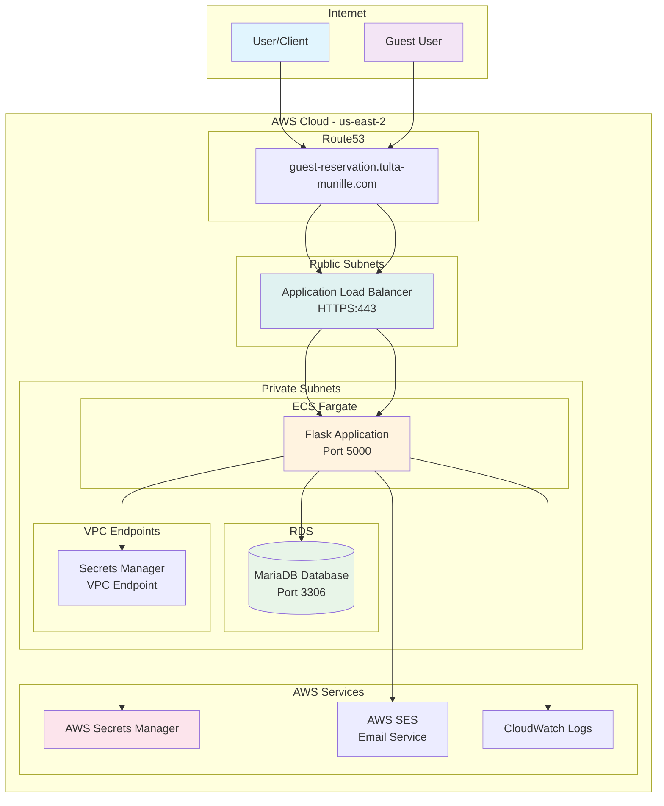
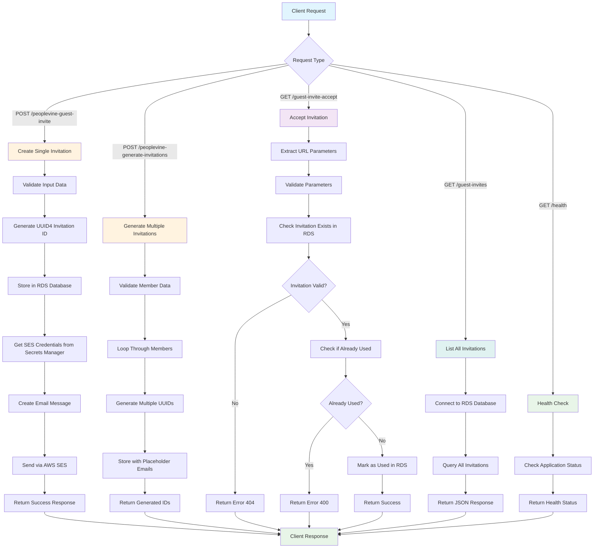
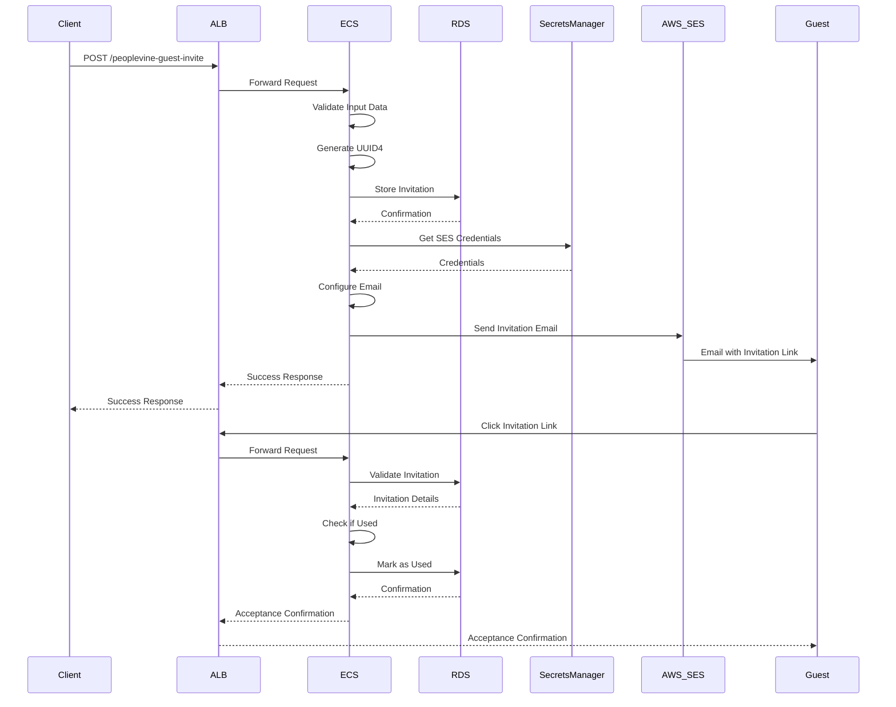

# Magic Castle Guest Invitation System

A Flask-based REST API for managing guest invitations in a membership system. This application handles guest invitation creation, email notifications, and invitation acceptance workflows, deployed on AWS using ECS Fargate, RDS MariaDB, and Application Load Balancer.

## 🏗️ Architecture Overview

The application is deployed on AWS with the following architecture:



## ✨ Features

- **Guest Invitation Management**: Create and manage guest invitations for members
- **Email Notifications**: Automated email sending via AWS SES
- **Database Persistence**: MariaDB database for storing invitation data
- **RESTful API**: Clean REST endpoints for all operations
- **CORS Support**: Cross-origin resource sharing for web frontend integration
- **Bulk Operations**: Generate multiple invitations at once
- **AWS Integration**: Secrets Manager, SES, CloudWatch Logs
- **Production Ready**: HTTPS, health checks, auto-scaling, monitoring

## 🌐 API Endpoints

### 1. Health Check
- **Endpoint**: `GET /health`
- **Purpose**: Application health monitoring
- **Response**: 
  ```json
  {
    "status": "healthy"
  }
  ```

### 2. Create Guest Invitation
- **Endpoint**: `POST /peoplevine-guest-invite`
- **Purpose**: Create a single guest invitation and send email notification
- **Payload**: 
  ```json
  {
    "first_name": "Member's first name",
    "last_name": "Member's last name",
    "memberID": "Member's unique ID",
    "guest_email": "Guest's email address"
  }
  ```

### 3. Generate Multiple Invitations
- **Endpoint**: `POST /peoplevine-generate-invitations`
- **Purpose**: Generate multiple invitation IDs for bulk operations
- **Authentication**: Required (username and token)
- **Payload**:
  ```json
  {
    "username": "someUser",
    "token": "someToken",
    "members": [
      {
        "memberID": "member_id_1",
        "numInvites": 5
      }
    ]
  }
  ```

### 4. Accept Guest Invitation
- **Endpoint**: `GET /guest-invite-accept`
- **Purpose**: Process guest invitation acceptance
- **Parameters**: `invitation_id`, `MemberID`, `guest_email`

### 5. List All Invitations
- **Endpoint**: `GET /guest-invites`
- **Purpose**: Retrieve all guest invitations (administrative)

## 🗄️ Database Schema

The application uses a single table `guest_invites` with the following structure:

| Column | Type | Description |
|--------|------|-------------|
| invitation_id | VARCHAR(36) | Primary key, UUID4 identifier |
| guest_email | VARCHAR(255) | Guest's email address |
| member_id | VARCHAR(255) | ID of the inviting member |
| created_at | TIMESTAMP | Creation timestamp |
| used | BOOLEAN | Whether invitation has been used |

## 🔄 Application Flow



## 📧 Email Flow



## 🚀 Infrastructure Components

### Core Services
- **ECS Fargate**: Containerized Flask application
- **RDS MariaDB**: Database for invitation storage
- **Application Load Balancer**: HTTPS termination and routing
- **Route53**: DNS management for custom domain

### Security & Secrets
- **AWS Secrets Manager**: Secure storage of API tokens and credentials
- **VPC Endpoints**: Private connectivity to AWS services
- **Security Groups**: Network-level access control
- **IAM Roles**: Service-to-service authentication

### Monitoring & Logging
- **CloudWatch Logs**: Application and infrastructure logging
- **ECS Service Discovery**: Automatic service registration
- **Health Checks**: Application and infrastructure monitoring

## 🛠️ Development & Deployment

### Prerequisites
- Python 3.13+
- Docker
- AWS CLI configured
- Terragrunt
- Terraform

### Local Development

1. **Clone the repository**:
   ```bash
   git clone <repository-url>
   cd mc-guest-reservation
   ```

2. **Set up environment variables**:
   ```bash
   export DB_HOST=localhost
   export DB_USER=root
   export DB_PASSWORD=your_password
   export DB_NAME=guest_reservations
   export PEOPLEVINE_TOKEN=your_token
   export SEVENROOMS_TOKEN=your_token
   ```

3. **Install dependencies**:
   ```bash
   pip install -r docker/requirements.txt
   ```

4. **Run the application**:
   ```bash
   python src/mc.py
   ```

### Docker Development

```bash
# Build the image
make build

# Run locally
make dev

# Check health
make health

# View logs
make logs
```

### Production Deployment

The application is deployed using Terragrunt on AWS:

```bash
# Deploy all infrastructure
terragrunt run-all apply

# Build and push Docker image
make deploy

# Check deployment status
aws ecs describe-services --cluster magic-castle-cluster --services magic-castle-service
```

## 🔒 Security Features

- **HTTPS Only**: All traffic encrypted in transit
- **Private Subnets**: Database and application in private networks
- **Secrets Management**: API tokens stored in AWS Secrets Manager
- **IAM Roles**: Least-privilege access for all services
- **Security Groups**: Network-level access control
- **VPC Endpoints**: Private connectivity to AWS services
- **Encryption**: Data encrypted at rest and in transit

## 📊 Monitoring & Observability

- **Health Checks**: Application health monitoring at `/health`
- **CloudWatch Logs**: Centralized logging for all components
- **ECS Service Discovery**: Automatic service registration
- **ALB Metrics**: Load balancer performance monitoring
- **RDS Monitoring**: Database performance insights

## 🔧 Configuration Management

### Environment Variables (ECS Task)
- `FLASK_ENV`: Set to "production"
- `SECRETS_MANAGER_ARN`: ARN of the secrets in AWS Secrets Manager
- `IMAGE_VERSION`: Version tag for the Docker image

### Secrets (AWS Secrets Manager)
- `PEOPLEVINE_TOKEN`: PeopleVine API authentication token
- `SEVENROOMS_TOKEN`: SevenRooms API authentication token
- `DB_HOST`: Database hostname
- `DB_PORT`: Database port (3306)
- `DB_NAME`: Database name
- `DB_USER`: Database username
- `DB_PASSWORD`: Database password
- `SES_ACCESS_KEY_ID`: AWS SES access key
- `SES_SECRET_ACCESS_KEY`: AWS SES secret key
- `SES_SMTP_PASSWORD`: AWS SES SMTP password

## 🚨 Error Handling

The application includes comprehensive error handling for:
- Database connection failures
- Invalid input data
- Email sending failures
- Duplicate invitation usage
- Missing required parameters
- AWS service errors
- Network connectivity issues

## 📈 Performance & Scaling

- **ECS Fargate**: Serverless container platform
- **Auto Scaling**: Automatic scaling based on CPU/memory usage
- **Load Balancing**: ALB distributes traffic across multiple tasks
- **Database Optimization**: RDS with connection pooling
- **Caching**: Application-level caching for frequently accessed data

## 🧪 Testing

### Health Check
```bash
curl https://guest-reservation.tulta-munille.com/health
```

### Create Invitation
```bash
curl -X POST https://guest-reservation.tulta-munille.com/peoplevine-guest-invite \
  -H "Content-Type: application/json" \
  -d '{
    "first_name": "John",
    "last_name": "Doe",
    "memberID": "12345",
    "guest_email": "guest@example.com"
  }'
```

## 🔄 CI/CD Pipeline

The application supports automated deployment:

1. **Code Push**: Triggered on main branch commits
2. **Docker Build**: Automated image building and testing
3. **ECR Push**: Image pushed to Amazon ECR
4. **ECS Update**: Service updated with new image
5. **Health Check**: Automated health verification

## 📚 Additional Documentation

- [Infrastructure Documentation](terraform/README.md)
- [Docker Configuration](docker/README.md)
- [Security Best Practices](terraform/SECURITY_GROUP_BEST_PRACTICES.md)
- [API Documentation](docs/api.md) (if available)

## 🤝 Contributing

1. Fork the repository
2. Create a feature branch
3. Make your changes
4. Test thoroughly
5. Submit a pull request

## 📄 License

This project is part of the Magic Castle membership system.

## 🆘 Support

For issues and questions:
1. Check the [troubleshooting guide](terraform/README.md#troubleshooting)
2. Review CloudWatch logs
3. Check ECS service status
4. Verify security group configurations
