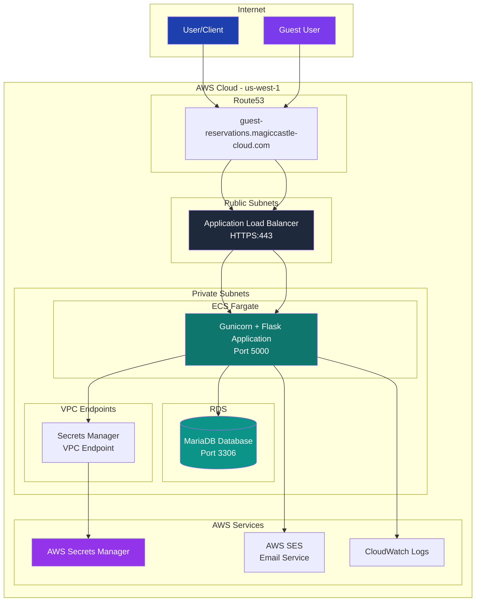
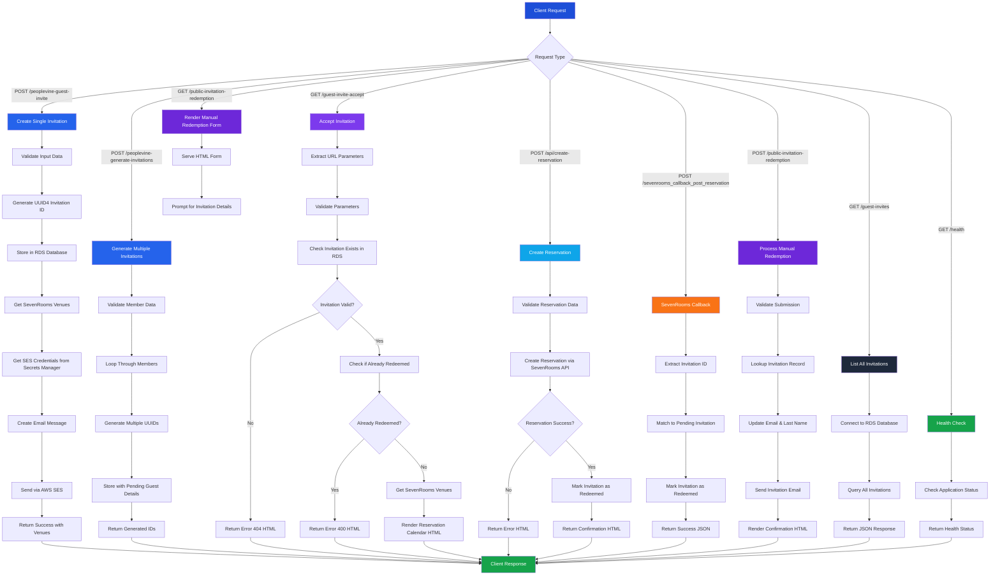
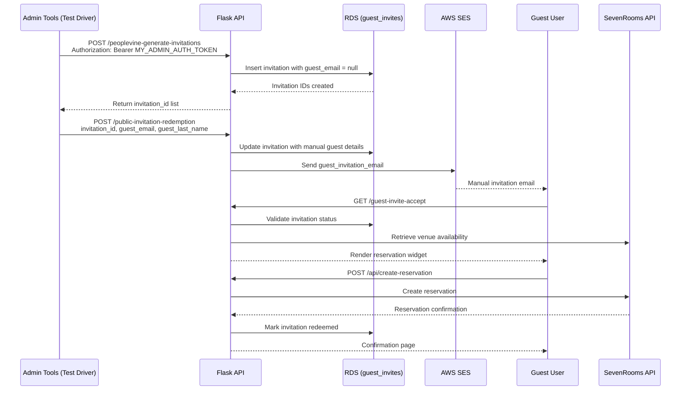
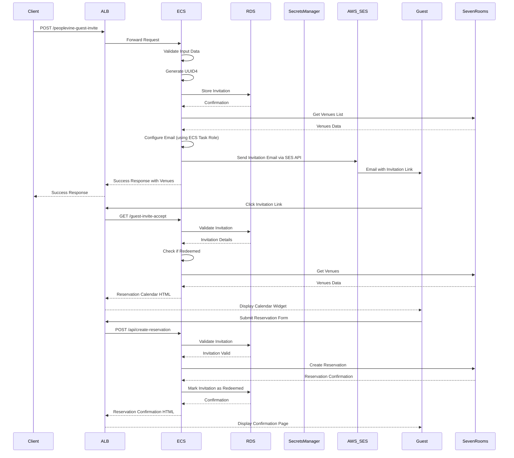

# Magic Castle Guest Invitation System

A Flask-based REST API (served via Gunicorn) for managing guest invitations in a membership system. This application handles guest invitation creation, email notifications, and invitation acceptance workflows, deployed on AWS using ECS Fargate, RDS MariaDB, and Application Load Balancer.

## 🏗️ Architecture Overview

The application is deployed on AWS with the following architecture:



## ✨ Features

- **Guest Invitation Management**: Create and manage guest invitations for members
- **Email Notifications**: Automated email sending via AWS SES
- **Database Persistence**: MariaDB database for storing invitation data
- **RESTful API**: Clean REST endpoints for all operations
- **CORS Support**: Cross-origin resource sharing for web frontend integration
- **Bulk Operations**: Generate multiple invitations at once
- **SevenRooms Integration**: Full reservation system integration with SevenRooms API
- **Reservation Calendar**: Interactive calendar widget for guests to select dates and times
- **Reservation Creation**: Direct reservation booking through SevenRooms API
- **AWS Integration**: Secrets Manager, SES, CloudWatch Logs
- **Production Ready**: HTTPS, health checks, auto-scaling, monitoring
- **Gunicorn WSGI Runtime**: Multi-worker server handling requests on port 5000

## 🌐 API Endpoints

### 1. Health Check
- **Endpoint**: `GET /health`
- **Purpose**: Application health monitoring
- **Response**: 
  ```json
  {
    "status": "healthy"
  }
  ```

### 2. Create Guest Invitation
- **Endpoint**: `POST /peoplevine-guest-invite`
- **Purpose**: Create a single guest invitation and send email notification
- **Authentication**: `Authorization: Bearer <MY_AUTH_TOKEN>`
- **Payload**: 
  ```json
  {
    "member_first_name": "Member's first name",
    "member_last_name": "Member's last name",
    "memberID": "Member's unique ID",
    "guest_email": "Guest's email address"
  }
  ```

### 3. Generate Multiple Invitations
- **Endpoint**: `POST /peoplevine-generate-invitations`
- **Purpose**: Generate multiple invitation IDs for bulk operations
- **Authentication**: `Authorization: Bearer <MY_ADMIN_AUTH_TOKEN>`
- **Payload**:
  ```json
  {
    "members": [
      {
        "memberID": "member_id_1",
        "member_first_name": "Magic",
        "member_last_name": "Castle",
        "numInvites": 5
      }
    ]
  }
  ```
- **Defaults**:
  - `memberID` defaults to `"0"` when omitted.
  - `member_first_name` defaults to `"Magic"`; `member_last_name` defaults to `"Castle"`.
  - Bulk invitations are stored with `guest_email = null` until a guest supplies their details.

### 4. Accept Guest Invitation
- **Endpoint**: `GET /guest-invite-accept`
- **Purpose**: Process guest invitation acceptance and display reservation calendar
- **Parameters**: `invitation_id`, `MemberID`, `guest_email`
- **Response**: HTML page with reservation calendar widget

### 5. Create Reservation
- **Endpoint**: `POST /api/create-reservation`
- **Purpose**: Create a reservation via SevenRooms API and mark invitation as redeemed
- **Payload**:
  ```json
  {
    "invitation_id": "550e8400-e29b-41d4-a716-446655440000",
    "venue_id": "12345",
    "date": "2025-11-15",
    "time": "19:00",
    "party_size": 4,
    "first_name": "John",
    "last_name": "Doe",
    "email": "guest@example.com",
    "phone": "555-555-5555"
  }
  ```
- **Response**: HTML confirmation page with reservation details

### 6. SevenRooms Callback
- **Endpoint**: `POST /sevenrooms_callback_post_reservation`
- **Purpose**: Webhook callback from SevenRooms after reservation is made
- **Authentication**: `Authorization: Bearer <MY_AUTH_TOKEN>`
- **Response**: JSON confirmation of invitation redemption

### 7. Public Invitation Redemption
- **Endpoints**: `GET /public-invitation-redemption`, `POST /public-invitation-redemption`
- **Purpose**: Allow guests to enter an invitation ID, email address, and last name to receive a fresh invitation email.
- **Response**: Branded HTML confirmation/notice page.

### 8. List All Invitations
- **Endpoint**: `GET /guest-invites`
- **Purpose**: Retrieve all guest invitations (administrative)
- **Authentication**: `Authorization: Bearer <MY_ADMIN_AUTH_TOKEN>`

### 9. Admin Dashboard
- **Endpoint**: `GET /dashboard`
- **Purpose**: Render an HTML dashboard with invitation metrics (created, redeemed, unredeemed, reservations made)
- **Authentication**: `Authorization: Bearer <MY_ADMIN_AUTH_TOKEN>`
- **Features**: Timeframe filter (1 day/week/month/year), live UTC clock reference, and toggle between tabular metrics and time-series graphs
- **Response**: HTML page with aggregated counts or charts depending on selected view

## 🗄️ Database Schema

The application uses a single table `guest_invites` with the following structure:

| Column | Type | Description |
|--------|------|-------------|
| invitation_id | VARCHAR(36) | Primary key, UUID4 identifier |
| guest_email | VARCHAR(255) NULL | Guest's email address (nullable) |
| guest_last_name | VARCHAR(255) NULL | Guest's last name (nullable) |
| member_id | VARCHAR(255) | ID of the inviting member |
| member_first_name | VARCHAR(255) NULL | Member first name |
| member_last_name | VARCHAR(255) NULL | Member last name |
| redeemed | BOOLEAN | Whether invitation has been redeemed |
| created_date | DATETIME | Date and time when invitation was created |
| redeemed_date | DATETIME | Date and time when invitation was redeemed |
| guest_clicked_date | DATETIME NULL | Timestamp recorded when guest clicks the invite link |
| reference_code | VARCHAR(128) NULL | SevenRooms reservation reference code |

## 🔄 Application Flow



## 🧑‍💼 Manual Reservation (Admin Tools)



## 📧 Email & Reservation Flow



## 🚀 Infrastructure Components

### Core Services
- **ECS Fargate (Spot)**: Containerized Flask application running on cost-optimized Fargate Spot capacity
- **RDS MariaDB**: Database for invitation storage
- **Application Load Balancer**: HTTPS termination and routing
- **Route53**: DNS management for custom domain

### Security & Secrets
- **AWS Secrets Manager**: Secure storage of API tokens and credentials
- **VPC Endpoints**: Private connectivity to AWS services
- **Security Groups**: Network-level access control
- **IAM Roles**: Service-to-service authentication

### Monitoring & Logging
- **CloudWatch Logs**: Application and infrastructure logging
- **ECS Service Discovery**: Automatic service registration
- **Health Checks**: Application and infrastructure monitoring

## 🛠️ Development & Deployment

### First-Time Setup

**IMPORTANT**: For first-time deployments, you must deploy the KMS key first and configure SOPS:

1. **Deploy KMS Key** (required for secrets encryption):
   ```bash
   cd terraform/kms
   terragrunt apply
   cd ..
   ```

2. **Get KMS Key ARN and configure SOPS**:
   ```bash
   cd kms && terragrunt output key_arn && cd ..
   # Update terraform/secrets/.sops.yaml with the key ARN
   ```

3. **Create and encrypt secrets**:
   ```bash
   sops terraform/secrets/config.yaml
   ```

For detailed setup instructions, see [terraform/SETUP.md](terraform/SETUP.md).

### Prerequisites
- Python 3.13+
- Docker
- AWS CLI configured
- Terragrunt
- Terraform
- SOPS (for secrets management)

### Local Development

1. **Clone the repository**:
   ```bash
   git clone <repository-url>
   cd mc-guest-reservation
   ```

2. **Set up environment variables**:
   ```bash
   export DB_HOST=localhost
   export DB_USER=root
   export DB_PASSWORD=your_password
   export DB_NAME=guest_reservations
   export PEOPLEVINE_TOKEN=your_token
   export SEVENROOMS_CLIENT_ID=your_client_id
  export SEVENROOMS_CLIENT_SECRET=your_client_secret
  export SEVENROOMS_HOST=https://api.sevenrooms.com
  export SEVENROOMS_VERSION=/2_4
  export SEVENROOMS_VENUE_ID=your_venue_id
  export SEVENROOMS_RESERVATION_WIDGET_URL=https://demo.sevenrooms.com/reservations/docs-ny
  export SEVENROOMS_WEBHOOK_CLIENT_ID=your_webhook_client_id
   ```

3. **Install dependencies**:
   ```bash
   pip install -r docker/requirements.txt
   ```

4. **Run the application**:
   ```bash
   gunicorn --chdir src --bind 0.0.0.0:5000 mc:app
   ```

   > Tip: Adjust concurrency with `GUNICORN_WORKERS=<count>` before running if you need more or fewer workers.

### Docker Development

```bash
# Build the image
make build

# Run locally
make dev

# Check health
make health

# View logs
make logs
```

### Production Deployment

The application is deployed using Terragrunt on AWS:

```bash
# Deploy all infrastructure
terragrunt run-all apply

# Build and push Docker image
make deploy

# Check deployment status
aws ecs describe-services --cluster magic-castle-cluster --services magic-castle-service
```

## 🔒 Security Features

- **HTTPS Only**: All traffic encrypted in transit
- **Private Subnets**: Database and application in private networks
- **Secrets Management**: API tokens stored in AWS Secrets Manager
- **IAM Roles**: Least-privilege access for all services
- **Security Groups**: Network-level access control
- **VPC Endpoints**: Private connectivity to AWS services
- **Encryption**: Data encrypted at rest and in transit

## 📊 Monitoring & Observability

- **Health Checks**: Application health monitoring at `/health`
- **CloudWatch Logs**: Centralized logging for all components
- **ECS Service Discovery**: Automatic service registration
- **ALB Metrics**: Load balancer performance monitoring
- **RDS Monitoring**: Database performance insights

## 🔧 Configuration Management

### Environment Variables (ECS Task)
- `FLASK_ENV`: Set to "production"
- `SECRETS_MANAGER_ARN`: ARN of the secrets in AWS Secrets Manager
- `IMAGE_VERSION`: Version tag for the Docker image
- `DISABLE_AUTHENTICATION_HEADERS`: Optional; set to `true` for local testing to bypass bearer-token checks
- `GUNICORN_WORKERS`: Optional; override Gunicorn worker count (default: 4 in containers)
- `GUNICORN_LOG_LEVEL`: Optional; override Gunicorn log level (default: `info`)
- `GUNICORN_TIMEOUT`: Optional; request timeout in seconds (default: 30)
- `GUNICORN_ACCESSLOG`: Optional; set to `-` (default) for stdout or provide a file path
- `GUNICORN_ERRORLOG`: Optional; set to `-` (default) for stderr or provide a file path

### Secrets (AWS Secrets Manager)
- `PEOPLEVINE_TOKEN`: PeopleVine API authentication token
- `MY_AUTH_TOKEN`: Incoming auth token for PeopleVine calls
- `MY_ADMIN_AUTH_TOKEN`: Admin auth token for privileged endpoints
- `MY_AUTH_ID`: Incoming auth id/username for PeopleVine calls
- `SEVENROOMS_CLIENT_ID`: SevenRooms API client ID (required for reservation system)
- `SEVENROOMS_CLIENT_SECRET`: SevenRooms API client secret (required for reservation system)
- `SEVENROOMS_HOST`: SevenRooms API host URL (default: https://api.sevenrooms.com)
- `SEVENROOMS_VERSION`: SevenRooms API version (default: /2_4)
- `SEVENROOMS_VENUE_ID`: SevenRooms venue identifier used when launching the widget
- `SEVENROOMS_WEBHOOK_CLIENT_ID`: SevenRooms client token used for widget callbacks
- `SEVENROOMS_RESERVATION_WIDGET_URL`: SevenRooms reservation widget base URL
- `DB_HOST`: Database hostname
- `DB_PORT`: Database port (3306)
- `DB_NAME`: Database name
- `DB_USER`: Database username
- `DB_PASSWORD`: Database password

**Note**: SES authentication is handled via ECS task role - no SMTP credentials needed.

**Secrets Update Workflow**: When modifying `terraform/secrets/config.yaml`, be sure to rerun the corresponding infrastructure updates (e.g. `terragrunt apply` for the secrets-manager module) and redeploy the ECS service so tasks pick up the refreshed secrets.

## 🚨 Error Handling

The application includes comprehensive error handling for:
- Database connection failures
- Invalid input data
- Email sending failures
- Duplicate invitation usage
- Missing required parameters
- AWS service errors
- Network connectivity issues

## 📈 Performance & Scaling

- **ECS Fargate (Spot)**: Serverless container platform leveraging Fargate Spot capacity for cost savings
- **Auto Scaling**: Automatic scaling based on CPU/memory usage
- **Load Balancing**: ALB distributes traffic across multiple tasks
- **Database Optimization**: RDS with connection pooling
- **Caching**: Application-level caching for frequently accessed data

## 🧪 Testing

### Health Check
```bash
curl https://guest-reservations.magiccastle-cloud.com/health
```

### Create Invitation
```bash
curl -X POST https://guest-reservations.magiccastle-cloud.com/peoplevine-guest-invite \
  -H "Content-Type: application/json" \
  -H "Authorization: Bearer $MY_AUTH_TOKEN" \
  -d '{
    "member_first_name": "John",
    "member_last_name": "Doe",
    "memberID": "12345",
    "guest_email": "guest@example.com"
  }'
```

### Create Reservation
```bash
curl -X POST https://guest-reservations.magiccastle-cloud.com/api/create-reservation \
  -H "Content-Type: application/json" \
  -H "Authorization: Bearer $MY_AUTH_TOKEN" \
  -d '{
    "invitation_id": "550e8400-e29b-41d4-a716-446655440000",
    "venue_id": "12345",
    "date": "2025-11-15",
    "time": "19:00",
    "party_size": 4,
    "first_name": "John",
    "last_name": "Doe",
    "email": "guest@example.com",
    "phone": "555-555-5555"
  }'
```

### Manual Invitation Redemption (JSON helper)
```bash
curl -X POST https://guest-reservations.magiccastle-cloud.com/public-invitation-redemption \
  -H "Content-Type: application/json" \
  -d '{
    "invitation_id": "550e8400-e29b-41d4-a716-446655440000",
    "guest_email": "updated-guest@example.com",
    "guest_last_name": "Guest"
  }'
```
> Tip: The same endpoint is accessible via browser at `/public-invitation-redemption`.

### Local Test Drivers
- `test.py`: Script used for local regression/automation testing.
- `test-drivers/` directory hosts the Flask-based test driver (`test-driver.py`) and accompanying HTML (`test-driver.html`) for manual end-to-end testing of invitation workflows. Launch via `python3 ./test-drivers/test-driver.py` or run `./test.sh`.

## 🔄 CI/CD Pipeline

The application supports automated deployment:

1. **Code Push**: Triggered on main branch commits
2. **Docker Build**: Automated image building and testing
3. **ECR Push**: Image pushed to Amazon ECR
4. **ECS Update**: Service updated with new image
5. **Health Check**: Automated health verification

## 📚 Additional Documentation

- [Infrastructure Documentation](terraform/README.md)
- [Docker Configuration](docker/README.md)
- [SevenRooms Integration](SevenRooms/README.md)
- [Security Best Practices](terraform/SECURITY_GROUP_BEST_PRACTICES.md)
- [API Documentation](docs/api.md) (if available)

## 🤝 Contributing

1. Fork the repository
2. Create a feature branch
3. Make your changes
4. Test thoroughly
5. Submit a pull request

## 📄 License

This project is part of the Magic Castle membership system.

## 🆘 Support

For issues and questions:
1. Check the [troubleshooting guide](terraform/README.md#troubleshooting)
2. Review CloudWatch logs
3. Check ECS service status
4. Verify security group configurations