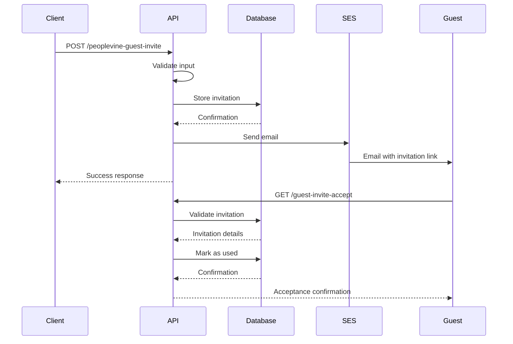
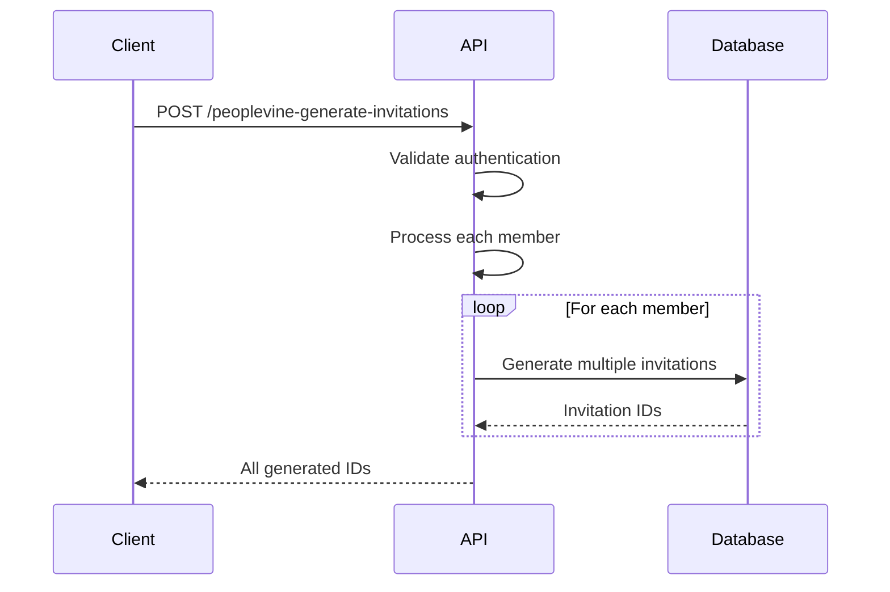

# API Documentation

This document provides comprehensive documentation for the Magic Castle Guest Invitation System REST API.

## 🌐 Base URL

**Production**: `https://guest-reservations.magiccastle-cloud.com`

## 🔐 Authentication

All protected endpoints expect a bearer token supplied via the `Authorization` header. Two tokens are recognised:

- `MY_AUTH_TOKEN` – standard operations (single invite creation, webhook callbacks)
- `MY_ADMIN_AUTH_TOKEN` – privileged operations (bulk generation, dashboards, registry views)

Example header:

```http
Authorization: Bearer YOUR_TOKEN_VALUE
```

For local debugging you can set `DISABLE_AUTHENTICATION_HEADERS=true`, which bypasses the header check at the Flask layer. Never enable this in production.

## 📋 API Endpoints

### 1. Health Check

Check the health status of the application.

**Endpoint**: `GET /health`

**Description**: Returns the current health status of the application.

**Request**:
```http
GET /health HTTP/1.1
Host: guest-reservations.magiccastle-cloud.com
```

**Response**:
```json
{
  "status": "healthy"
}
```

**Status Codes**:
- `200 OK` - Application is healthy
- `503 Service Unavailable` - Application is unhealthy

---

### 2. Create Guest Invitation

Create a single guest invitation, send the SES email, and optionally render an HTML form for manual use.

**Endpoints**:
- `GET /peoplevine-guest-invite` – renders the admin form (requires admin token unless headers are disabled)
- `POST /peoplevine-guest-invite` – processes JSON or form submissions

**Authentication**: `Authorization: Bearer <MY_AUTH_TOKEN>` or `Authorization: Bearer <MY_ADMIN_AUTH_TOKEN>`

**POST request (JSON)**:
```http
POST /peoplevine-guest-invite HTTP/1.1
Host: guest-reservations.magiccastle-cloud.com
Authorization: Bearer <MY_AUTH_TOKEN_OR_MY_ADMIN_AUTH_TOKEN>
Content-Type: application/json

{
  "member_first_name": "John",
  "member_last_name": "Doe",
  "memberID": "12345",
  "guest_email": "guest@example.com",
  "guest_last_name": "Smith"
}
```

**Request Body**:
| Field | Type | Required | Description |
|-------|------|----------|-------------|
| `member_first_name` | string | Yes | Member's first name |
| `member_last_name` | string | Yes | Member's last name |
| `memberID` | string | Yes | Member's unique identifier |
| `guest_email` | string | Yes | Guest's email address |
| `guest_last_name` | string | Yes | Guest's last name |

**JSON Response**:
```json
{
  "status": "success",
  "message": "Invitation processed, stored, and email sent",
  "invitation_id": "550e8400-e29b-41d4-a716-446655440000",
  "guest_email": "guest@example.com",
  "member_id": "12345"
}
```

**HTML Response** (form submission): success and validation errors render inside `peoplevine_guest_invite.html` with friendly messaging.

**Status Codes**:
- `200 OK` - Invitation created successfully
- `400 Bad Request` - Missing or invalid fields
- `401 Unauthorized` - Missing/invalid token when headers enforced
- `500 Internal Server Error` - Email/DB failure

**Error Response**:
```json
{
  "success": false,
  "error": "Invalid email address format"
}
```

> Tip: Substitute `<MY_AUTH_TOKEN_OR_MY_ADMIN_AUTH_TOKEN>` with the bearer token value you intend to use (standard or admin).

---

### 3. Generate Multiple Invitations

Generate multiple invitation IDs for bulk operations. Provides both an HTML admin console and a JSON API.

**Endpoints**:
- `GET /peoplevine-generate-invitations` – renders the admin UI (`peoplevine_generate_invitations.html`)
- `POST /peoplevine-generate-invitations` – accepts JSON or form submissions

**Authentication**: `Authorization: Bearer <MY_ADMIN_AUTH_TOKEN>`

**POST request (JSON)**:
```http
POST /peoplevine-generate-invitations HTTP/1.1
Host: guest-reservations.magiccastle-cloud.com
Authorization: Bearer <MY_ADMIN_AUTH_TOKEN>
Content-Type: application/json

{
  "members": [
    {
      "memberID": "12345",
      "member_first_name": "Magic",
      "member_last_name": "Castle",
      "numInvites": 5
    }
  ]
}
```

**Request Body**:
| Field | Type | Required | Description |
|-------|------|----------|-------------|
| `members` | array | Yes | Array of member objects |
| `members[].memberID` | string | No | Member's unique identifier (defaults to `"0"`) |
| `members[].member_first_name` | string | No | Member first name (defaults to `"Magic"`) |
| `members[].member_last_name` | string | No | Member last name (defaults to `"Castle"`) |
| `members[].numInvites` | integer | Yes | Number of invitations to generate |

**JSON Response**:
```json
{
  "status": "success",
  "message": "Invitations generated successfully",
  "results": [
    {
      "member_id": "12345",
      "invitation_ids": [
        "550e8400-e29b-41d4-a716-446655440001",
        "550e8400-e29b-41d4-a716-446655440002"
      ]
    }
  ]
}
```

**HTML Response**: success and error messaging render inline within the admin UI, accompanied by JSON output pretty-printed for convenience.

**Status Codes**:
- `200 OK` - Invitations generated successfully
- `400 Bad Request` - Invalid or incomplete member data
- `401 Unauthorized` - Missing/invalid admin token
- `500 Internal Server Error` - Database failure

**Error Response**:
```json
{
  "success": false,
  "error": "Invalid authentication credentials"
}
```

---

### 4. Accept Guest Invitation

Processes guest invitation acceptance. Intended for guests clicking the emailed link.

**Endpoint**: `GET /guest-invite-accept`

**Description**: Validates invitation parameters, tracks click events, and redirects the guest to the SevenRooms reservation widget. If the invitation is invalid or already redeemed, branded HTML pages explain the issue.

**Query Parameters**:
| Parameter | Type | Required | Description |
|-----------|------|----------|-------------|
| `invitation_id` | string | Yes | The invitation ID to accept |
| `MemberID` | string | Yes | Member ID associated with the invitation |
| `guest_email` | string | Yes | Guest's email address |

**Responses**:
- Redirect to SevenRooms widget on success
- `invitation_not_found.html` (HTTP 404) if the ID is unknown
- `invitation_redeemed.html` (HTTP 400) if already used
- JSON `{ "status": "error", ... }` when an unexpected failure occurs

---

### 5. SevenRooms Reservation Callback

Handle callbacks from SevenRooms after a reservation is created or updated. The callback is used to automatically mark invitations as redeemed when the reservation matches our criteria.

**Endpoint**: `POST /sevenrooms_callback_post_reservation`

**Authentication**: `Authorization: Bearer <MY_AUTH_TOKEN>` or `Authorization: Bearer <MY_ADMIN_AUTH_TOKEN>`

**Description**: Processes a SevenRooms webhook payload, and—if a single matching invitation is found—marks it as redeemed and sends a confirmation email.

**Matching Logic**:
- Only consider invitations that are currently unredeemed and whose `guest_clicked_date` falls within the `REDEMPTION_LOOKBACK_MINUTES` window (15 minutes by default) prior to the SevenRooms `updated` timestamp.
- If more than one candidate remains, narrow to invitations whose normalized guest email exactly matches the callback payload.
- If ambiguity persists, narrow to invitations whose normalized (lowercased) guest last name matches the payload.
- Redeem only when exactly one candidate remains; otherwise log the ambiguity and skip redemption.

**Success Response**:
```json
{
  "status": "success",
  "reference_code": "ABC123",
  "matched_invitation": "550e8400-e29b-41d4-a716-446655440000",
  "candidates_considered": 2,
  "email_status": "sent"
}
```

**Status Codes**:
- `200 OK` - Callback processed (even when no invitation was redeemed)
- `400 Bad Request` - Invalid payload
- `500 Internal Server Error` - Server error

---

### 6. Public Invitation Redemption

Allow guests to manually update their invitation email and receive the invitation.

**Endpoints**: `GET /public-invitation-redemption`, `POST /public-invitation-redemption`

**Description**:
- **GET** returns a branded HTML form.
- **POST** accepts JSON or form-encoded data, updates the invitation record (only if `guest_email` / `guest_last_name` are blank), resends the invitation email, and renders a confirmation/notice page.

**Request (JSON helper)**:
```http
POST /public-invitation-redemption HTTP/1.1
Host: guest-reservations.magiccastle-cloud.com
Content-Type: application/json

{
  "invitation_id": "550e8400-e29b-41d4-a716-446655440000",
  "guest_email": "updated-guest@example.com",
  "guest_last_name": "Guest"
}
```

**Status Codes**:
- `200 OK` - Invitation updated and email sent (HTML confirmation)
- `400 Bad Request` - Missing required fields / already populated
- `404 Not Found` - Invitation ID not found
- `500 Internal Server Error` - Database or email failure

### 7. List All Invitations

Retrieve a list of all guest invitations. Useful for admins cross-checking data.

**Endpoint**: `GET /admin-dump-database`

**Authentication**: `Authorization: Bearer <MY_ADMIN_AUTH_TOKEN>` and debug mode enabled (`DEBUG_ENABLED=true`)

**Outputs**:
- **HTML (default)** – Renders `guest_invites_table.html`, an interactive grid with sorting, search, and pagination powered by Simple-DataTables.
- **JSON** – Returned when `?format=json` is supplied or the request has `Accept: application/json`.

**Sample JSON Response**:
```json
{
  "guest_invites": [
    {
      "invitation_id": "550e8400-e29b-41d4-a716-446655440000",
      "guest_email": "guest1@example.com",
      "guest_last_name": "Guest",
      "member_id": "12345",
      "member_first_name": "Magic",
      "member_last_name": "Castle",
      "redeemed": true,
      "created_date": "2025-03-01 10:30:00",
      "redeemed_date": "2025-03-02 09:00:00",
      "guest_clicked_date": "2025-03-01 12:15:00"
    }
  ],
  "total": 1
}
```

### 9. Admin Dashboard

Render an HTML dashboard page summarizing invitation metrics.

**Endpoint**: `GET /dashboard`

**Authentication**: `Authorization: Bearer <MY_ADMIN_AUTH_TOKEN>`

**Description**: Generates an HTML view with the total number of invitations created, invitations redeemed, unredeemed invitations, and reservations confirmed (based on webhook callbacks). Supports timeframe selection (1 day, 1 week, 1 month, 1 year), displays a live UTC reference clock, and provides a toggle between tabular metrics and time-series graphs.

**Response**: HTML page (cards or charts depending on selected view).

**Status Codes**:
- `200 OK` - Dashboard rendered successfully
- `401 Unauthorized` - Missing or invalid admin token
- `500 Internal Server Error` - Unable to load metrics from the database

## 🔄 API Flow Examples

### Complete Invitation Flow



### Bulk Invitation Generation



## 🚨 Error Handling

### Common Error Responses

#### 400 Bad Request
```json
{
  "success": false,
  "error": "Missing required field: first_name"
}
```

#### 401 Unauthorized
```json
{
  "success": false,
  "error": "Invalid authentication credentials"
}
```

#### 404 Not Found
```json
{
  "success": false,
  "error": "Invitation not found"
}
```

#### 500 Internal Server Error
```json
{
  "success": false,
  "error": "Database connection failed"
}
```

### Error Codes

| Code | Description | Possible Causes |
|------|-------------|-----------------|
| `INVALID_EMAIL` | Invalid email format | Malformed email address |
| `MISSING_FIELD` | Required field missing | Missing required parameter |
| `INVALID_AUTH` | Authentication failed | Wrong username/token |
| `INVITATION_NOT_FOUND` | Invitation doesn't exist | Invalid invitation ID |
| `INVITATION_USED` | Invitation already used | Duplicate acceptance attempt |
| `DB_CONNECTION_ERROR` | Database connection failed | Database unavailable |
| `EMAIL_SEND_ERROR` | Email sending failed | SES configuration issue |

## 📊 Rate Limiting

Currently, there are no rate limits implemented. For production use, consider implementing:

- **Per IP**: 100 requests per minute
- **Per Endpoint**: 50 requests per minute for bulk operations
- **Per User**: 200 requests per minute

## 🔒 Security Considerations

### Input Validation
- All input is validated and sanitized
- Email addresses are validated for format
- Member IDs are validated for format
- SQL injection protection through parameterized queries

### Authentication
- Bulk operations require authentication
- Credentials should be stored securely
- Consider implementing JWT tokens for better security

### CORS
- CORS is enabled for cross-origin requests
- Configure allowed origins for production

## 🧪 Testing

### Health Check Test
```bash
curl -X GET https://guest-reservations.magiccastle-cloud.com/health
```

### Create Invitation Test
```bash
curl -X POST https://guest-reservations.magiccastle-cloud.com/peoplevine-guest-invite \
  -H "Content-Type: application/json" \
  -H "Authorization: Bearer $MY_AUTH_TOKEN" \
  -d '{
    "first_name": "John",
    "last_name": "Doe",
    "memberID": "12345",
    "guest_email": "guest@example.com"
  }'
```

### Bulk Generation Test
```bash
curl -X POST https://guest-reservations.magiccastle-cloud.com/peoplevine-generate-invitations \
  -H "Content-Type: application/json" \
  -H "Authorization: Bearer $MY_ADMIN_AUTH_TOKEN" \
  -d '{
    "members": [
      {
        "memberID": "12345",
        "numInvites": 3
      }
    ]
  }'
```

### Accept Invitation Test
```bash
curl -i "https://guest-reservations.magiccastle-cloud.com/guest-invite-accept?invitation_id=550e8400-e29b-41d4-a716-446655440000&MemberID=12345&guest_email=guest@example.com"
```
> Expect a `302` redirect to the SevenRooms widget or an HTML error page.

## 📈 Monitoring

### Health Monitoring
- **Endpoint**: `/health`
- **Frequency**: Every 30 seconds
- **Timeout**: 10 seconds
- **Retries**: 3

### Metrics to Monitor
- **Response Time**: Average response time per endpoint
- **Error Rate**: Percentage of failed requests
- **Throughput**: Requests per second
- **Database Connections**: Active database connections

### Logging
- All requests are logged with timestamps
- Error responses include detailed error information
- Database queries are logged for debugging

## 🔄 Versioning

Current API version: **v1**

### Version Strategy
- **URL Versioning**: `/v1/endpoint`
- **Header Versioning**: `API-Version: v1`
- **Backward Compatibility**: Maintained for at least 6 months

## 📚 Additional Resources

- [Application Documentation](../README.md)
- [Infrastructure Documentation](../terraform/README.md)
- [Docker Configuration](../docker/README.md)
- [AWS SES Documentation](https://docs.aws.amazon.com/ses/)
- [Flask Documentation](https://flask.palletsprojects.com/)
